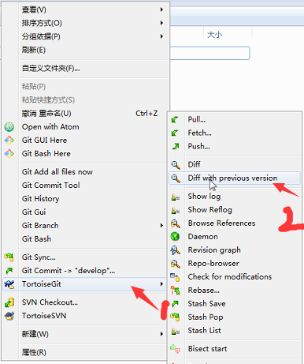
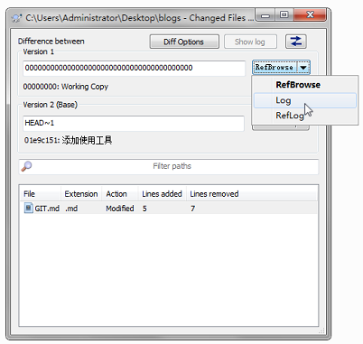
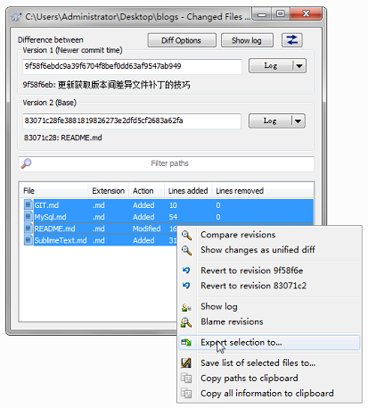

# Git

## Git使用技巧
### 制作FTP上传补丁
1. 下载程序源码到本地，对程序文件进行版本控制。`git init`
2. 修改并提交到版本库。
3. 在根目录右键/TortoiseGit/Diff with previous vision;选择对应的分支和版本（vision1选择最新的，vision2选择起始版本，先选择分支，再选择版本）;对话框下方即差异文件，全选/右键/Export selectioin to...;选择目录并保存.

4. 将补丁文件上传至服务器即可。（导出的补丁文件位置和服务器的位置是对应的所以直接覆盖就可以）

\*注:使用工具Git TortoiseGit
