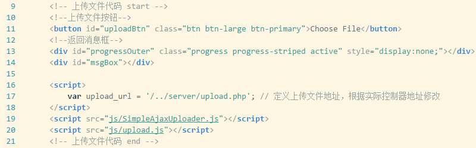
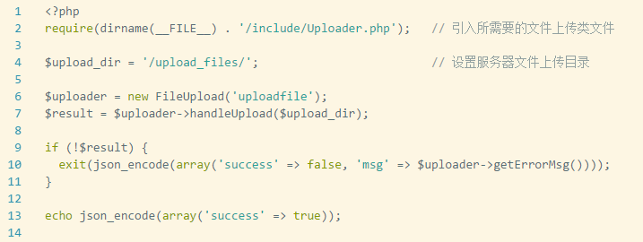

# Ajax方式上传图片
## 所用工具：[Simple-Ajax-Uploader](https://github.com/LPology/Simple-Ajax-Uploader)
## 使用Simple-Ajax-Uploader 提供的简单示例做部分缩减，方便代码加入到项目中使用
### 代码示例
#### HTML代码

#### PHP代码

[下载代码](download/ajaxupload.rar)

#### 使用说明
1. 将js文件放入项目文件夹
2. 将html代码粘贴到项目文件中
3. 修改引入js路径
4. 将上传控制器复制到项目文件夹，（若引入文件和控制器文件不在同一文件夹下）修改引入文件路径
5. 调试控制器正常，即访问上传控制器出现 {"success":false,"msg":"Incorrect upload name or no file uploaded"}
6. 在html代码中设置上传路径地址